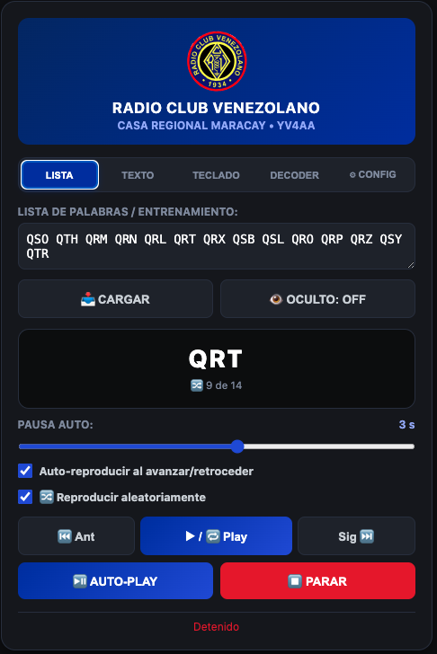

# ESP32 CW Trainer & Morse Decoder — YV4AA

> ⚠️ **BETA / EN FASE BETA** — This project is under active development. The firmware is functional and tested, but APIs, thresholds and features may change. **Electronic component specifications (BOM, schematic, PCB) will be published soon.** / Este proyecto está en desarrollo activo. El firmware es funcional y probado, pero las APIs, umbrales y funciones pueden cambiar. **Próximamente se publicarán las especificaciones de componentes electrónicos (BOM, esquemático, PCB).**

---

**Morse code trainer + real-time adaptive decoder** for the Radio Club Venezolano — Casa Regional Maracay (YV4AA).

**Entrenador de código Morse + decodificador adaptativo en tiempo real** para el Radio Club Venezolano — Casa Regional Maracay (YV4AA).

---

### 📸 Web UI / Interfaz web

## 🇬🇧 English

### What is it?

A standalone **ESP32** device that:

- **Plays** Morse code from text (buzzer + LED), 5–45 WPM, tone 300–1500 Hz
- **Decodes** a straight key in real time with an adaptive, robust decoder
- Runs a **captive portal WiFi** with an embedded dark-theme web UI (no app needed, works on any phone)
- **Coaches timing**: shows a live consistency score (0–100%) so operators can improve their rhythm without frustration
- Persists settings (WPM / tone / volume / WiFi) in NVS flash

Built for radio clubs, classrooms, and self-training.

### Hardware / Pinout

| GPIO | Function |
|------|----------|
| 25 | Audio buzzer / PWM output |
| 27 | Status LED |
| 32 | Straight key input (INPUT_PULLUP) |

> ⚠️ GPIO 18 was the original key input but is **damaged** (stuck LOW, likely ESD) and must not be used. Key input lives on GPIO 32.
> ⚠️ GPIO 18 era la entrada original de llave pero está **dañado** (clavado en LOW, probable ESD) y no debe usarse. La llave vive en GPIO 32.

### Features

- **Morse player**: text → audio with LED; prosign **SK**; adjustable WPM/tone/volume
- **Adaptive decoder** (straight key only):
  - **Deferred per-character decision**: raw durations are buffered unclassified; on char-end silence, **all elements are classified at once** against a stable median
  - Classification dit < 1.5× / dah > 2.0× with tolerant gray zone by proximity to 1.75×
  - Speed estimated with the **median of complete characters** (double median + ±25% rate-limit per char) — no WPM drift
  - **Intra-character gaps** feed the speed estimator (immune to classification → no deadlock at low speeds) with slow re-anchoring (×1.8, with restore)
  - Char/word ends follow the **real Morse structure** (char ≈ 2.2 dits, word ≈ 6.0 dits)
  - Invalid characters emit `?` and **never pollute** speed or the timing metric
  - Full architecture: [DECODER.md](DECODER.md)
- **Timing coach**: live consistency metric (coefficient of variation → 0–100%), color-coded in the UI
- **Captive portal** WiFi: own AP `CW_Trainer_YV4AA` (pass `12345678`), plus STA mode with saved credentials
- **Web UI**: 5 tabs (List, Text, Keyboard, Decoder, Config), dark theme
  - List tab: flashcards, **shuffle mode**, infinite auto-play, blind mode (hidden word), auto-pause slider
  - Decoder tab: live decoded text, WPM, **timing badge**, Morse legend
- **NVS persistence** for WPM/tone/volume and WiFi credentials

### Getting started

1. Install [Arduino IDE](https://www.arduino.cc/en/software) with the [ESP32 core 2.0.6](https://github.com/espressif/arduino-esp32)
2. Open `cw_trainer.ino` (keep `index_html.h` and `logo.h` in the same folder)
3. Select your ESP32 board (e.g. "ESP32 Dev Module")
4. Wire the buzzer to GPIO 25, LED to GPIO 27, straight key to GPIO 32 (and GND)
5. Flash and power on
6. Connect to the `CW_Trainer_YV4AA` WiFi (password `12345678`) and open `http://192.168.4.1`

### How the decoder works (short version)

Morse timing has a strict structure: dit = 1 unit, dah = 3, element gap = 1, char gap = 3, word gap = 7. The decoder uses **deferred per-character decision**:

1. Measures every key press duration and intra-character gap (polling, 16 ms debounce)
2. Buffers raw durations **without classifying** them
3. On char-end silence, classifies **all elements at once** against a stable median (dit < 1.5×, dah > 2.0×, gray zone 1.75×)
4. Emits characters/words when silences match the Morse structure (char ≈ 2.2×, word ≈ 6.0×)
5. Updates speed only from **complete valid characters** (double median + ±25% rate-limit; slow re-anchor ×1.8 with restore)
6. Computes a **consistency score** (CV of dits + gaps) for coaching

Full technical documentation: [DECODER.md](DECODER.md)

### Tunable parameters

| Constant | Location | Default | Meaning |
|----------|----------|---------|---------|
| `ELEMENT_MIN_MS` | `.ino` | 16 ms | Debounce / minimum element |
| dit/dah thresholds | `isDahElem()` | 1.5× / 2.0× (gray 1.75×) | Classification thresholds |
| Char end | decoder | 2.2× dit | Silence to end a character |
| Word end | decoder | 6.0× dit | Silence to end a word |
| Speed rate-limit | `updateSpeedFromChar()` | ±25% per char | Max speed change per char |
| Slow re-anchor | decoder | ×1.8 (floor 60 ms) | Retry invalid char with slower median |
| Gap sample cap | decoder | 2.1× | Max gap accepted as speed sample |
| `DECODED_MAX_LEN` | `.ino` | 800 | Decoded buffer length |

### License

[MIT](LICENSE) — free to use, modify, and share. Built with ❤️ for the amateur radio community.

---

## 🇻🇪 Español

### ¿Qué es?

Un dispositivo **ESP32** autónomo que:

- **Reproduce** código Morse desde texto (buzzer + LED), 5–45 WPM, tono 300–1500 Hz
- **Decodifica** una llave simple en tiempo real con un decoder adaptativo y robusto
- Levanta un **portal cautivo WiFi** con interfaz web embebida en tema oscuro (sin app, funciona en cualquier teléfono)
- **Entrena el timing**: muestra un puntaje de consistencia en vivo (0–100%) para que los operadores mejoren su ritmo sin frustración
- Persiste la configuración (WPM / tono / volumen / WiFi) en flash NVS

Hecho para radio clubes, aulas y auto-entrenamiento.

### Hardware / Pines

| GPIO | Función |
|------|---------|
| 25 | Buzzer de audio / salida PWM |
| 27 | LED indicador |
| 32 | Entrada de llave simple (INPUT_PULLUP) |

### Características

- **Reproductor Morse**: texto → audio con LED; prosign **SK**; WPM/tono/volumen ajustables
- **Decoder adaptativo** (solo llave simple):
  - **Decisión diferida por carácter**: las duraciones crudas se acumulan sin clasificar; al llegar el silencio de fin de carácter, **todos los elementos se clasifican de una vez** contra una mediana estable
  - Clasificación dit < 1.5× / dah > 2.0× con zona gris tolerante por cercanía a 1.75×
  - Velocidad estimada con la **mediana de caracteres completos** (doble mediana + rate-limit ±25% por carácter) — sin deriva de WPM
  - Los **gaps intra-carácter** alimentan el estimador de velocidad (inmunes a la clasificación → sin deadlock a baja velocidad) con re-anclaje lento (×1.8, con restauración)
  - Fines de carácter/palabra según la **estructura morse real** (carácter ≈ 2.2 dits, palabra ≈ 6.0 dits)
  - Los caracteres inválidos emiten `?` y **nunca contaminan** la velocidad ni la métrica de timing
  - Arquitectura completa: [DECODER.md](DECODER.md)
- **Entrenador de timing**: métrica de consistencia en vivo (coeficiente de variación → 0–100%), con colores en la UI
- **Portal cautivo** WiFi: AP propio `CW_Trainer_YV4AA` (clave `12345678`), más modo STA con credenciales guardadas
- **Interfaz web**: 5 pestañas (Lista, Texto, Teclado, Decoder, Config), tema oscuro
  - Pestaña Lista: flashcards, **modo aleatorio**, auto-reproducción infinita, modo oculto (palabra escondida), slider de pausa automática
  - Pestaña Decoder: texto decodificado en vivo, WPM, **badge de timing**, leyenda Morse
- **Persistencia NVS** para WPM/tono/volumen y credenciales WiFi

### Primeros pasos

1. Instala [Arduino IDE](https://www.arduino.cc/en/software) con el [core ESP32 2.0.6](https://github.com/espressif/arduino-esp32)
2. Abre `cw_trainer.ino` (mantén `index_html.h` y `logo.h` en la misma carpeta)
3. Selecciona tu placa ESP32 (ej. "ESP32 Dev Module")
4. Conecta el buzzer al GPIO 25, el LED al GPIO 27, la llave simple al GPIO 32 (y GND)
5. Flashea y enciende
6. Conéctate a la WiFi `CW_Trainer_YV4AA` (clave `12345678`) y abre `http://192.168.4.1`

### Cómo funciona el decoder (versión corta)

El timing Morse tiene una estructura estricta: dit = 1 unidad, dah = 3, gap entre elementos = 1, gap entre caracteres = 3, gap entre palabras = 7. El decoder usa **decisión diferida por carácter**:

1. Mide cada duración de pulsación y el gap intra-carácter (polling, antirrebote de 16 ms)
2. Acumula las duraciones crudas **sin clasificarlas**
3. Al llegar el silencio de fin de carácter, clasifica **todos los elementos de una vez** contra una mediana estable (dit < 1.5×, dah > 2.0×, zona gris 1.75×)
4. Emite caracteres/palabras cuando los silencios coinciden con la estructura Morse (carácter ≈ 2.2×, palabra ≈ 6.0×)
5. Actualiza la velocidad solo con **caracteres completos válidos** (doble mediana + rate-limit ±25%; re-anclaje lento ×1.8 con restauración)
6. Calcula un **puntaje de consistencia** (CV de dits + gaps) para el entrenamiento

Documentación técnica completa: [DECODER.md](DECODER.md)

### Parámetros ajustables

| Constante | Ubicación | Default | Significado |
|-----------|-----------|---------|-------------|
| `ELEMENT_MIN_MS` | `.ino` | 16 ms | Antirrebote / elemento mínimo |
| Umbrales dit/dah | `isDahElem()` | 1.5× / 2.0× (gris 1.75×) | Umbrales de clasificación |
| Fin de carácter | decoder | 2.2× dit | Silencio para cerrar un carácter |
| Fin de palabra | decoder | 6.0× dit | Silencio para cerrar una palabra |
| Rate-limit de velocidad | `updateSpeedFromChar()` | ±25% por carácter | Cambio máximo de velocidad por carácter |
| Re-anclaje lento | decoder | ×1.8 (piso 60 ms) | Reintentar carácter inválido con mediana más lenta |
| Techo del gap como muestra | decoder | 2.1× | Gap máximo aceptado como muestra de velocidad |
| `DECODED_MAX_LEN` | `.ino` | 800 | Largo del buffer decodificado |

### Licencia

[MIT](LICENSE) — libre de usar, modificar y compartir. Hecho con ❤️ para la comunidad de radioaficionados.

---

## 🤝 Contributing / Contribuciones

Found a bug or want a feature? Open an issue or a PR. Ideas welcome: paddle support, OTA updates, more prosigns, session logs, iambic mode.

¿Encontraste un bug o quieres una mejora? Abre un issue o un PR. Ideas bienvenidas: soporte de paddle, actualización OTA, más prosigns, registro de sesiones, modo iámbico.

**73 de YV4AA** 📻
